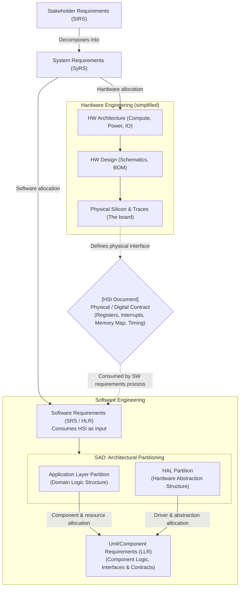
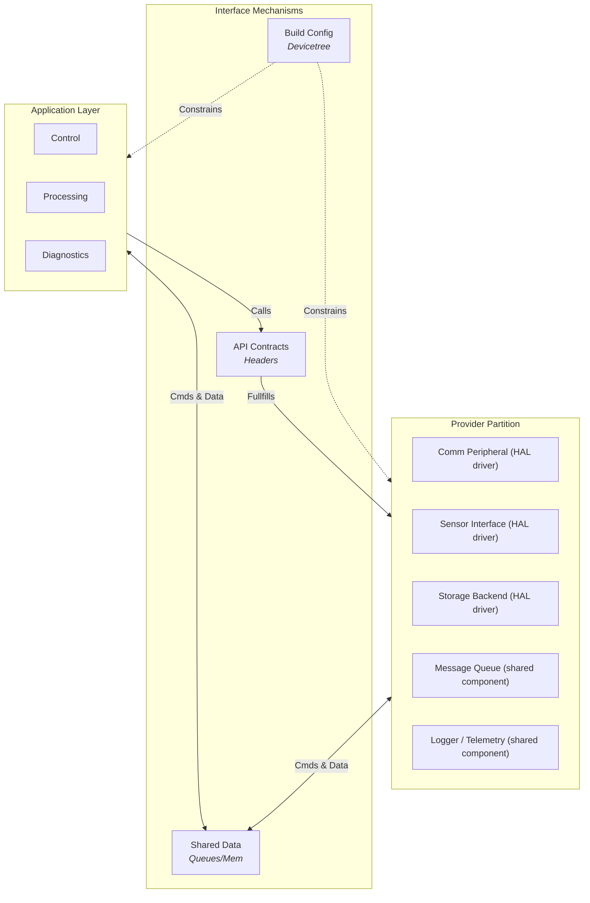

## Design Intent, Plans and Requirements

When we talk about design intent we might not consider at what "level" or what "kind" of intent. Agentic coding CLIs allow us to express our intent as free text. It could be a mix of stakeholder goals, detailed component requirements, interface requirements etc. 
Consider our naive weather station prompt from last week:

> **Prompt:** Create an application that reads temperature and humidity from the attached BME280 via I2C every 10 s. The application shall correct the readings and print them to the serial console as degrees C and percent relative humidity respectively.

This is a requirement masquerading as a request, but its expected result is a low level implementation in code, so it leaves out important details on how to read the temperature, correct the readings and print them. All of those details will be inferred.
With the agentic AI CLIs we could ask for a plan that we can correct iteratively before we allow the agent to write any code. This allows us loop on some of the assumptions that resulted from our initial prompt before any code is written. But the plans are in terms of the delta between the current state and the interpretation of the next goal state, and they are thrown away once acted upon, so they are not really useful to retain as requirements.

In embedded projects we traditionally manage requirements in layers such as stakeholder, system and software requirements. Then we further split them into functional and non-functional, design and interface requirements. How we do this and the exact language we use depends on what industry and what kind of certification we are targeting, but the purpose of the entire exercise is to enable organisations to develop products that adhere to strict safety and quality standards. If an organisation is an entity consisting of people with different experiences and motivations that exhibit non-deterministic behaviour and outputs, perhaps a similar approach can work for AI agents?


## A Layered Requirements Model

The following graph shows a hierarchy of system and software engineering requirement types and their relationships. In this example, the terminology derives mainly from IEEE 29148/1016 and DO-178C and the language varies across industries and safety/integrity criticality levels but the concepts are quite similar in between. This can be a lot to process if not familiar with Systems Engineering concepts or the V-model, but gives us the terminology we need to reason about how we can improve our approach. Skim this part if it feels dense, and use it as reference for later if needed.



See [Appendix](#appendix-system-requirements-concepts-reference) for definitions.

## Interface Mechanisms

In addition to requirements we need to reason about interfaces as they allow us to separate concerns between layers and domains. This graph shows examples of interface mechanisms in our embedded context that can be versioned independently of other requirements.




## The Software Requirements for the Weather Station Example

The examples we are discussing are too trivial for a complete set of process documents, so we will go directly from System Requirements to the Software Requirements Specification layer with an inline SAD section for design requirements and ICDs for interfaces. We will also assert the combined board and overlay DeviceTrees are granular enough to serve as our HSI, and
finally we are assuming that the LLRs can be inferred completely and that we don't need to spell them out.

First we establish a set of System Requirements (SysRS). Each requirement needs a unique ID which is a bit awkward in markdown but it will become clear later why this is needed. As you can see only the first requirement SyRS-WX-001 is reflected in our naive prompt, and we have taken out the references to hardware as it will be implied by the HSI in another layer. We also add requirements for the monitoring we introduced in the previous post, and clarified that the error state indication must also propagate to console.

|ID|System Requirement|
|------------|------------|
|`SyRS-WX-001`|The system shall acquire ambient temperature and humidity measurements every 10 seconds and output the readings to the serial console.|
|`SyRS-WX-002`|The system shall make the most recent, physically valid temperature and humidity measurements continuously available to other internal system functions.|
|`SyRS-WX-003`|The system shall detect a sensor communication loss if valid data is not received for 30 seconds, and notify the user via the serial console.|
|`SyRS-WX-004`|The system shall provide a continuous visual warning via a dedicated hardware indicator (LED) while the sensor communication loss condition is active.|

As per the layered model in the diagram, we combine these requirements with the HSI and get the following combined Software Requirements Specification (SRS): [weatherstation_srs.md](https://github.com/olofattemo/agentic-firmware-experiment/tree/main/experiments/part2/nrf54ldk-bme280.step1/specs/weatherstation_srs.md)

## Generating code from SRS

> **Prompt:** Read the repository that contains an empty application for the nRF54L15 on the nRF54L15-DK board with a pre-configured DeviceTree. Read the specification from specs/weatherstation_srs.md. Generate a step-by-step plan for the implementation.
>For every function, struct, or significant logic block you write, you must include a comment tagging the specific requirement ID it fulfills (e.g., // Implements: SRS-WX-022).

Gemini said:
> I have developed a plan based on the SRS and the DeviceTree overlay. I'll now present it for your approval.

<details>
<summary>Full Gemini response:</summary>
  Implementation Plan for Weather Station Application

  Phase 1: Environment & Configuration
   1. Configuration (prj.conf): Enable required Zephyr subsystems: CONFIG_SENSOR, CONFIG_BME280, CONFIG_I2C, CONFIG_GPIO, and
      CONFIG_CBPRINTF_FP_SUPPORT for floating-point printk.
   2. Shared Memory Implementation:
       * Create src/Weather_SharedMem.h and src/Weather_SharedMem.c.
       * Define Weather_SharedData_t as per §5.1.
       * Implement Weather_GetSharedData() to return a pointer to a singleton instance.
       * Initialize with sentinel values: temperature_degC = -999.0f, humidity_pctRH = 0xFF, update_counter = 0, error_active = false.
       * Implement a mutex mechanism to ensure atomicity of updates (Requirement: §5.1).

  Phase 2: Core Components
   3. Weather Sensor Component (src/weather_sensor.c/h):
       * Define Weather_Sensor_Task as a thread with a 10s period (SRS-WX-001).
       * Initialize BME280 using device_is_ready().
       * Implement the measurement loop:
           * Fetch samples from BME280 (SRS-WX-002).
           * Validate range: T (-40 to +85°C), RH (0 to 100%) (SRS-WX-023).
           * Handle fetch/get errors by retaining previous values and omitting updates (SRS-WX-022).
           * On success: Update shared memory, increment counter atomically, and store timestamp (SRS-WX-003, SRS-WX-004, SRS-WX-005).
           * Console output: Print formatted values or error message depending on error_active state (SRS-WX-006, SRS-WX-007).

   4. Staleness Monitor Component (src/weather_monitor.c/h):
       * Define Staleness_Monitor_Task as a thread with a 1s period (SRS-WX-020).
       * Compare the current time with the last successful update timestamp.
       * If the gap exceeds 30s: Set error_active = true and assert the fault LED (SRS-WX-020, SRS-WX-008).
       * If gap <= 30s: Set error_active = false and deassert the fault LED (SRS-WX-021, SRS-WX-009).

  Phase 3: Integration & Validation
   5. Main Entry (src/main.c):
       * Start both task threads.
       * Ensure all functions and logic blocks are tagged with Requirement IDs (e.g., // Implements: SRS-WX-001).

  Does this plan meet your expectations? Please let me know if you'd like any adjustments before I proceed with the implementation.
</details>

> **Prompt:** Yes
(The Gemini plan was accepted without modification and it provided a summary of the results.)

Gemini said:
>  Implementation Summary: ...

<details>
<summary>Full Gemini response:</summary>

   1. Configuration: Updated prj.conf with CONFIG_SENSOR, CONFIG_BME280, CONFIG_I2C, CONFIG_GPIO, and floating-point support for printk.
   2. Shared Memory Component:
       * src/Weather_SharedMem.h/c: Implements the singleton data structure with mutex protection.
       * Uses SYS_INIT to ensure initialization with sentinel values before application threads start.
   3. Weather Sensor Component:
       * src/weather_sensor.h/c: Implements a 10s periodic task that fetches data from the BME280, validates it against physical ranges,
         updates shared memory, and prints to the console as per §5.2.
   4. Staleness Monitor Component:
       * src/weather_monitor.h/c: Implements a 1s periodic task that monitors the last update timestamp. If data is older than 30s, it sets
         the error flag and asserts the fault LED (led0).
   5. Integration:
       * src/main.c: Defines and starts the task threads.
       * CMakeLists.txt: Updated to include all source files.
</details>


The code builds without errors. Below we can see the difference between our previous approach and the new approach with our consolidated SRS
requirements model.

\
**main.c:** 
```c
#include <zephyr/kernel.h>
#include "Weather_SharedMem.h"
#include "weather_sensor.h"
#include "weather_monitor.h"

// Implements: §4.2 Task Mapping
#define STACK_SIZE 1024
#define PRIORITY 7

K_THREAD_DEFINE(weather_sensor_tid, STACK_SIZE,
                Weather_Sensor_Task_Entry, NULL, NULL, NULL,
                PRIORITY, 0, 0);

K_THREAD_DEFINE(staleness_monitor_tid, STACK_SIZE,
                Weather_Monitor_Task_Entry, NULL, NULL, NULL,
                PRIORITY, 0, 0);

int main(void)
{
    // Tasks started by K_THREAD_DEFINE
    return 0;
}
```

**weather_sensor.c:** 
```c
void Weather_Sensor_Task_Entry(void *p1, void *p2, void *p3) {
    const struct device *const dev = DEVICE_DT_GET_ANY(bosch_bme280);

    // Implements: §3.3 Operational Modes (INIT)
    if (dev == NULL || !device_is_ready(dev)) {
        printk("Error: Device \"%s\" is not ready; check the devicetree.\n", dev->name);
        return;
    }
    while (1) {
        struct sensor_value temp, humid;
        int rc;

        // Implements: SRS-WX-001 (Measurement Period 10s)
        int64_t next_run = k_uptime_get() + K_SECONDS(MEASUREMENT_PERIOD_S).ticks;

        // Implements: SRS-WX-002 (Retrieve data via sensor_sample_fetch)
        rc = sensor_sample_fetch(dev);

        if (rc == 0) {
            // Implements: SRS-WX-002 (sensor_channel_get)
            sensor_channel_get(dev, SENSOR_CHAN_AMBIENT_TEMP, &temp);
            sensor_channel_get(dev, SENSOR_CHAN_HUMIDITY, &humid);

            float32_t t_val = sensor_value_to_double(&temp);
            float32_t h_val = sensor_value_to_double(&humid);

            // Implements: SRS-WX-023 (Physical Range Check)
            if (t_val >= TEMP_MIN_DEGC && t_val <= TEMP_MAX_DEGC &&
                h_val >= (float32_t)HUMID_MIN_PCT && h_val <= (float32_t)HUMID_MAX_PCT) {
                
                // Implements: SRS-WX-003, SRS-WX-004, SRS-WX-005 (Update shared memory)
                Weather_UpdateSharedData(t_val, (uint8_t)h_val);
            } else {
                // Implements: SRS-WX-023 (Discard invalid readings)
            }
        } else {
            // Implements: SRS-WX-022 (Discard reading on sensor fetch error)
        }

        const volatile Weather_SharedData_t* shared = Weather_GetSharedData();

        // Implements: SRS-WX-006, SRS-WX-007, §5.2 (UART output format)
        if (shared->error_active) {
            // Implements: SRS-WX-007 (Error format)
            printk("Error: Sensor communication failure\n");
        } else if (shared->update_counter > 0) {
            // Implements: SRS-WX-006 (Normal format)
            printk("T: %.1f C, RH: %u %%\n", 
                   (double)shared->temperature_degC, 
                   (unsigned int)shared->humidity_pctRH);
        }

        // Wait for next cycle
        k_sleep(K_TIMEOUT_ABS_MS(next_run));
    }
}
```
Full output: [step1](https://github.com/olofattemo/agentic-firmware-experiment/tree/main/experiments/part2/nrf54ldk-bme280.step1)

See the difference? Unlike our previous attempts, the link between intent and code becomes clear.
We previously discovered that the LLM  we are using has enough training on Zephyr and our board to successfully reason about DeviceTree, Kconfig and other concepts we depend on for the design. Now we have introduced more granular, clear and explicitly separated functional requirements alongside design and interface sections for precision, and introduced a persistence format in the form of a consolidated Software Requirements Specification. We also added traceability to code in the generation step which makes the mapping between requirements and code easy to see and understand.

## Summary and Next Steps

Next time we will explore the benefits of this approach and how we can make it work for us despite the apparent increase in granularity of instructions we have to manage.

## Appendix: System Requirements Concepts Reference

| Abbr. | Name | Description | Origin | Also Known As |
|-------|------|-------------|--------|---------------|
| **StRS** | Stakeholder Requirements Specification | Formally stated, traceable requirements from stakeholders with measurable acceptance criteria.| IEEE 29148 | |
| **SyRS** | System Requirements Specification | Black-box system behavior, technology-agnostic. What the complete system does, not how. | IEEE 29148 | |
| **HSI** | Hardware/Software Interface | Boundary contract between HW and SW. Defines registers, interrupts, memory maps, timing, etc. | DO-178C | HW/SW ICD |
| **SRS** | Software Requirements Specification | What the software must do, derived from system requirements and constrained by the HSI. The document that contains HLRs. | IEEE 29148 | HLR document (DO-178C) |
| **LLR** | Low-Level Requirement | A software requirement detailed enough that source code can be directly implemented from it without further information. | DO-178C; ASPICE SWE.3 | Detailed SW Requirement, Module/Component/Unit Requirement |
| **SAD** | Software Architectural Design | Partitioning of software requirements into components, relationships, interfaces, resource allocation, and design rationale. | ASPICE SWE.2; DO-178C; IEEE 1016 | Software Architecture Document, SDD (ambigous acronym)|
| **ICD** | Interface Control Document | The complete, controlled description of an interface between two systems or components. Contains both requirements (IRS) and design (IDD). | Industry convention | Interface Spec, Protocol Spec. Contains both IRS and IDD content |
| **IRS** | Interface Requirements Specification | The requirements side of an interface — what it shall do. Testable behavioral statements independent of implementation. | IEEE 29148 | Interface Requirement Document |
| **IDD** | Interface Design Description | The design side of an interface — how it is implemented. Concrete representations: byte formats, register addresses, protocol encoding. | IEEE 1016 | Interface Design Document, Wire Format Spec |
| **HAL** | Hardware Abstraction Layer | The software layer that isolates application logic from hardware specifics. Provides a stable API that survives hardware changes. | Industry convention | |
