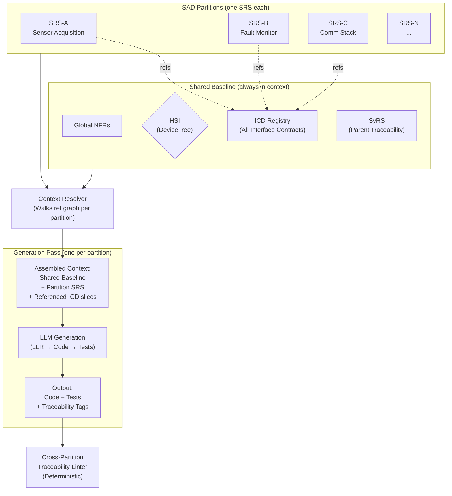

## Conclusions

Over the last four posts, we moved from naive vibe-coding to a structured, systems-engineering pipeline. We proved that LLMs can generate functional firmware if constrained by rigorous requirements and deterministic verification. But two questions remain: what limits do we have, and what is missing to deploy this in practice?

In this part I will address the issue of scaling the spec sizes that lingers from the previous post. I will then present a taxonomy of the various failure modes we have seen throughout the series, and how we have mitigated them.
Finally I will elaborate on what I think is currently more and less workable when it comes to using LLMs in the process of firmware development for constrained devices.

## Scaling requirements driven code generation with specification size

In the previous post, the spec "weatherstation_srs_with_llrs_out.md" is about 3k tokens. As we expect model attention to degrade rather rapidly with the number of tokens we should assume a practical limit of 25-50% of the max input size can be used.
For the LLM we are using that is in the range of 250k-500k tokens. We also need to consider the limit to the number of tokens can be used for output which is only 64k. Gemini 3.1 Pro is a thinking model and the thinking output counts toward the output limit.
When examining the logs from the single prompt action in step1 of part 4 ("SRS with LLRs to Code with Traces and Unit Tests"). Gemini CLI breaks the main generation phase into multiple API calls (reverse order):

| Step | Process Phase | Input (tokens) | Thought (tokens) | Output (tokens) | Description |
| :--- | :--- | :--- | :--- | :--- | :--- |
| 5 |**Test File Creation** | 28096 | 2046 | 241 | Unit test (z-test) generation |
| 4 |**File Creation** | 18216 | 4525 | 2588 | Firmware code generation |
| 3 |**Development Process** | 16514 | 1071 | 40 | Evaluating how to generate code |
| 2 |**Analyzing Structure** | 15995 | 190 | 86 | Reading the repo context (inc DeviceTree) |
| 1 |**File Analysis** | 12559 | 314 | 33 | Reading the weatherstation_srs_with_llrs_out.md specification |

Notice as each step accumulates input tokens, and how the input size with spec and context grows up to 28k tokens in step 5. Conclusion here is that we will start having scaling issues at ~10x the size of our current specification. The limits are both in input attention, and output saturation on the file creation steps. The thought process generates a considerable amount of output and we need to make sure it does not cause the code output to be truncated.
In a larger project we need multiple independent specs, but we can also partition them using the SAD-mappings we already introduced. This would require a scheduler to resolve the references and feed each partition to the LLM separately. Relevant interface specifications are shared to define connections between the parts while HSI and shared NFRs would have to be replicated into each partition by the scheduler.

## The taxonomy of failures

### 1. Factual knowledge conflicts

The model produces plausible output based on training data that is wrong, outdated, or conflated across similar but distinct sources. Sparse, stale, or conflated knowledge in training data, combined with tendency to produce confident output without flagging when confidence is low.

**Examples:**
- Fabrication of details about specific hardware it was not meaningfully trained on. [[Part 2: Naive Example]](https://olofattemo.github.io/agentic-firmware-experiment/posts/2026-03-20-what-a-million-tokens-cant-fix/#naive-example-vibe-coding-a-weather-station)
- Conflating interfaces across chip revisions because older or more common hardware dominates the training corpus. [[Part 1: LLMs trained on evolving interfaces]](https://olofattemo.github.io/agentic-firmware-experiment/posts/2026-03-13-the-experiment-begins/#llms-trained-on-evolving-interfaces)

**Mitigation:**
Inject authoritative documentation (datasheets, errata, devicetree) as context. Constrain the model to use existing vetted drivers rather than generate new ones.

### 2. Requirement ambiguity

The model generates output that deviates from stated requirements because it filled gaps silently. Requirements as typically written in plain English are too vague for direct LLM consumption. The model must produce complete output and will infer defaults when requirements are ambiguous.

**Examples:**
- Resolving unspecified aspects using training distribution defaults rather than flagging the ambiguity. [[Part 2: Unintended changes]](https://olofattemo.github.io/agentic-firmware-experiment/posts/2026-03-20-what-a-million-tokens-cant-fix/#unintended-changes)
- Generated code that matches the model's interpretation of the requirement rather than the requirement itself. [[Part 4: Analysing the output]](https://olofattemo.github.io/agentic-firmware-experiment/posts/2026-04-10-the-requirements-pipeline/#analysing-the-output)

**Mitigation:**
Formal requirements with explicit format, range, and behavior constraints. Pinned specification sets in context. Deterministic trace checking that verifies 1:1 mapping between implementation and requirements.

### 3. Lost in the middle
As specifications and conversation history grow, the model attends more strongly to content at the beginning and end of its context than to content in the middle. Requirements clearly stated early in a session get dropped or silently reinterpreted as context accumulates. Also attention to middle tokens is structurally lower than attention to beginning and end tokens, regardless of instruction importance.

**Examples:**
- Requirements placed in the middle of a long document receive less model attention than those at the edges. [[Part 4: The maximum size of a requirements document]](https://olofattemo.github.io/agentic-firmware-experiment/posts/2026-04-17-experiment-conclusion/#scaling-requirements-driven-code-generation-with-specification-size)

**Mitigation:**
Pinning specifications as baselined artifacts that are re-injected rather than compacted. Keeping individual specification artifacts within sizes where middle-position degradation is acceptable.

### 4. Sycophancy (and framing effects)
The model produces output shaped by what it perceives the user wants rather than by what is true. Models are by default biased to respond in ways that rewards agreement, compliance, and producing expected outputs over producing truthful ones.

**Examples:**
- Confidently produces wrong output, then reverses equally confidently when challenged. [[Part 2: Naive Example]](https://olofattemo.github.io/agentic-firmware-experiment/posts/2026-03-20-what-a-million-tokens-cant-fix/#naive-example-vibe-coding-a-weather-station)
- Accepts an implicit framing the user introduces, even when alternatives exist. [[Part 4: Analysing the output]](https://olofattemo.github.io/agentic-firmware-experiment/posts/2026-04-10-the-requirements-pipeline/#analysing-the-output)
- Produces documentation claiming coverage or verification that doesn't exist. [[Part 4: Analysing the output]](https://olofattemo.github.io/agentic-firmware-experiment/posts/2026-04-10-the-requirements-pipeline/#analysing-the-output)

**Mitigation:**
Deterministic external verification that doesn't depend on the model's self-assessment (the traceability linter). Not treating conversational correction as a verification mechanism. 
Explicit instruction to the model to report what it did not do and why, and to list alternatives rather than accept the framing.

### Summary table

|Category|Suggested mitigation|
|--|--|
|1. Factual knowledge conflicts|Curation of authoritative context, use vetted drivers/HAL|
|2. Requirement ambiguity|Formal requirements, curated specification, traceability|
|3. Lost in the middle|Curated specification, specification size management|
|4. Sycophancy (and framing effects)|Deterministic external verification, open framing|

## Recommendations on the current state of AI agents and firmware development

These come with the obvious risk that they won't age well. We are still early and immature in applying AI to firmware, and the field is moving fast. Treat this as a snapshot rather than a verdict.

| Area | Recommendation | Why |
|---|---|---|
| **Drivers/HAL** | Avoid generating drivers. Use vetted ones from the RTOS or vendor SDK. | Driver generation requires automated hardware validation in the loop, but instrumenting everything is impractical. Spend the time you saved on spec on using, and getting to know your target hardware. If you have recent hardware and really need to write a driver your docs may be wrong and the errata not exist yet, and AI won't save you. |
| **Bare-metal code critique** | Write bare metal code manually if needed, and use AI with curated context to critique your reasoning. | This inverts the usual workflow: you write, the model reviews. Be prepared to carefully dispel overzealous critiques with tests and evidence. This may be more of a help than asking the model to produce bare-metal code directly. |
| **Control theory** | Don't expect to be able to do control loops with LLMs alone. | You need direct understanding of the plant physics and the controller. Use established deterministic tooling for design and tuning. LLMs can help with surrounding integration but cannot substitute for control engineering. |
| **Constrained UIs** | Do UIs for small displays manually, or shift the UI to another less constrained device and keep the view protocol minimal. | Layout correctness is geometric, not linguistic. Specialized UI tools will get you there faster. |
| **Systems engineering** | Use AI for requirements drafting, specification refinement, traceability, and verification artifact generation. | This is where the series showed LLMs actually help. Requirements are in the domain expert's natural vocabulary and review is fast. Traceability annotations can be generated and verified deterministically. |
| **Application-layer code** | AI-generated code above well-defined hardware abstractions can genuinely accelerate you, provided outputs can be deterministically verified and results looped back to the agent. | The model's training data is rich above the HAL boundary. Deterministic verification catches the silent failures the model introduces. |
| **Verification strategy** | Make deterministic verification a first-class part of the process, not a deliverable. Assume every LLM decision has a non-zero error probability, even with clear instructions. | If the output is opaque to verification, you should assume mistakes exist by design. |

## What I expect the future to hold for AI agents and embedded firmware

- Agent loopback paths (agent "tooling") through trace instrumentation, HIL, in-circuit debuggers, and simulation environments. Closing the feedback loop between generated code and its runtime behavior, so the agent can observe outcomes and correct itself against the real system rather than against its own assumptions.
The grace-period bug from post 4 would likely have been caught automatically if the agent could flash the board, capture the RTT console output, and compare the boot-time error message against SyRS-WX-003's 30-second requirement

- Agent loopback paths through hardware instrumentation. Integrating logic analyzers and oscilloscopes into the agent's observation layer. Silent failures on buses and protocols cannot be caught by inspecting code, they require the ability to read the wire.
This would be interesting, even if we would need to know critical details about what to instrument for our use case as we could not feed all the hardware signals back to the LLM even at relatively low resolutions.

- Better methods for handling the HSI. Going beyond the partial coverage that devicetree provides today, so the agent has an authoritative, machine-readable view of timing, errata, power sequencing, and electrical constraints.

- Packaging spec-driven agent workflows tailored for embedded teams. I expect current agent harnesses are too unhinged to deploy practically for work in structured team workflows. I am looking forward to seeing tooling that addresses this.

## Wrapping up

If you read this far I hope you enjoyed the series. I was not sure AI agents would be useful at all for firmware when I started. But now we have seen that using AI to generate specification to guide code, tests and traceability checks can be used to improve the process, and to mitigate some of the failure modes of AI and development teams alike. Just remember always to verify using deterministic methods.

This series is now frozen in time but the field will evolve rapidly. I will adjust my opinions whenever the evidence changes even if the articles don't. This is my suggestion to anyone, verify and challenge whatever you read and try to find new angles where there are limitations.
